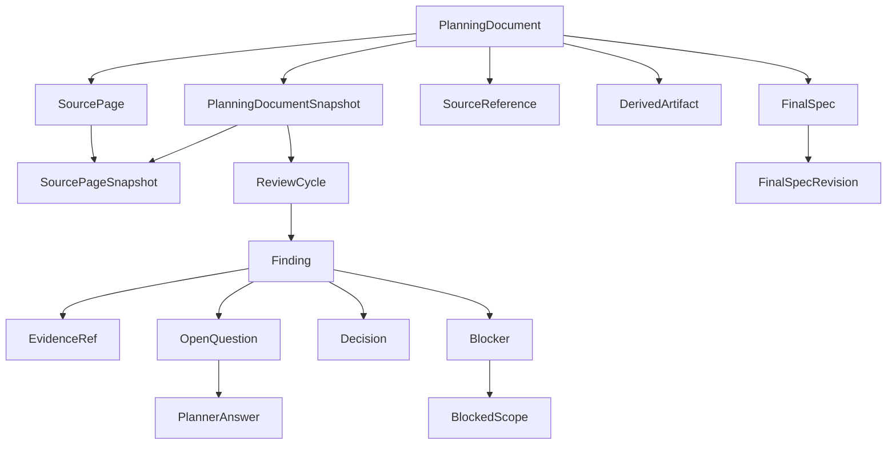

---
meta:
  title: "기획 검토 시스템의 핵심 객체는 어떻게 연결되는가"
  contentType: "Reference"
  category: "Internal planning"
status: "Draft"
---

# 기획 검토 시스템의 핵심 객체는 어떻게 연결되는가

이 문서는 Notion 원문, 검토 결과, 결정, 차단 범위, 최종설계, 실제 구현을 연결하는 핵심 도메인 객체를 정의한다.
[문서 계획](../00_INDEX.md#문서-계획)에 따라 저장 기술과 연동 형식보다 먼저 객체 책임과 불변 규칙을 고정한다.

## 모델링 원칙

도메인 모델은 물리적인 Notion 페이지와 논리적인 기획 문서를 분리한다.
같은 로컬 디렉터리에 원문 미러와 개발 산출물이 함께 있어도 출처와 역할을 객체로 구분한다.

모든 구현은 다음 원칙을 따른다:

- 내부 객체는 시스템이 발급한 불변 식별자를 사용한다
- Notion `page_id`, 파일 경로, Git 브랜치 이름은 내부 식별자를 대체하지 않는다
- 확정 원문과 결정 이력은 덮어쓰지 않는다
- 기획자 답변은 개발자 재검증 전까지 Decision이 아니다
- Blocker는 결정 주체가 아니라 진행 제한을 표현한다
- 로컬 개발 문서 변경은 기획 원문 변경으로 취급하지 않는다
- 인공지능(AI) 분석 결과는 개발자가 채택하기 전까지 후보 정보다

식별자의 실제 타입과 저장 형식은 데이터베이스 설계에서 정한다.

## 핵심 객체는 원문, 검토, 결정, 구현 계층으로 나뉜다

핵심 관계는 다음과 같다:

변경 추적용 `ChangeSet`, `ChangeItem`, `ImpactLink`와 구현 연결용 `ImplementationRef`는 같은 객체를 참조한다.
자세한 관계는 [추적 모델](./traceability-model.md)에서 정의한다.

## `PlanningDocument`는 하나의 논리 기획을 나타낸다

`PlanningDocument`는 모니터링 대상 Notion 데이터베이스의 행 페이지 하나를 기준으로 생성한다.
기획 제목이나 로컬 경로가 바뀌어도 Notion `page_id`가 같으면 같은 기획 문서다.

최소 속성은 다음과 같다:

- `planning_document_id`: 내부 불변 식별자
- `source_type`: 현재는 `NOTION`
- `notion_database_id`: 소유 Notion 데이터베이스 식별자
- `root_notion_page_id`: 데이터베이스 행 페이지 식별자
- `title`: 현재 표시 제목
- `source_status`: 원문 접근 가능 상태

`source_status`의 상세 상태값은 저장 모델에서 확정한다.
원문이 archive되어도 `PlanningDocument`와 과거 이력은 삭제하지 않는다.

## `SourcePage`는 기획을 구성하는 실제 Notion 페이지다

하나의 `PlanningDocument`는 여러 `SourcePage`로 구성될 수 있다.
데이터베이스 행 페이지와 그 안에서 `/페이지`로 만든 하위 페이지를 같은 논리 기획에 포함한다.

최소 속성은 다음과 같다:

- `source_page_id`: 내부 불변 식별자
- `planning_document_id`: 소속 기획 문서
- `notion_page_id`: 실제 Notion 페이지 식별자
- `parent_source_page_id`: 상위 SourcePage, ROOT에서는 비어 있음
- `role`: `ROOT` 또는 `COMPOSED_CHILD`
- `title`: 현재 페이지 제목

`COMPOSED_CHILD`는 다른 `COMPOSED_CHILD` 아래에서도 재귀적으로 존재할 수 있다.
시스템이 만든 개발 검토 페이지는 `SourcePage`로 등록하지 않는다.

## `SourcePageSnapshot`은 실제 페이지의 불변 사본이다

`SourcePageSnapshot`은 특정 시점의 SourcePage 내용을 보존한다.
정규화된 원문 내용이 바뀔 때만 새 Snapshot을 만든다.

최소 속성은 다음과 같다:

- `source_page_snapshot_id`: 내부 불변 식별자
- `source_page_id`: 대상 SourcePage
- `previous_snapshot_id`: 직전 Snapshot
- `content_hash`: 정규화한 페이지 내용 hash
- `content_ref`: 보존된 원문 내용 위치
- `captured_at`: 수집 완료 시점

정규화 범위는 [Notion 원문 계약](../integration/notion-source-contract.md)을 따른다.

## `PlanningDocumentSnapshot`은 기획 전체의 불변 버전이다

`PlanningDocumentSnapshot`은 특정 시점의 ROOT와 모든 COMPOSED_CHILD Snapshot을 묶는다.
페이지 하나만 바뀌어도 기획 전체 버전은 새 Snapshot으로 표현할 수 있다.

최소 속성은 다음과 같다:

- `planning_document_snapshot_id`: 내부 불변 식별자
- `planning_document_id`: 대상 기획 문서
- `previous_snapshot_id`: 직전 기획 전체 Snapshot
- `source_page_snapshot_ids`: 포함된 실제 페이지 Snapshot
- `aggregate_hash`: 페이지 내용과 부모 관계를 합친 hash
- `captured_at`: 일관된 수집이 끝난 시점

ReviewCycle과 Source Diff는 개별 페이지 Snapshot보다 `PlanningDocumentSnapshot`을 기준으로 시작한다.

## `SourceReference`는 다른 페이지를 참조하는 관계다

기획 페이지 안의 링크, 멘션, Relation 속성이 기존 다른 페이지를 가리키면 `SourceReference`로 관리한다.
참조 대상의 전체 내용은 현재 PlanningDocumentSnapshot에 포함하지 않는다.

최소 속성은 다음과 같다:

- `source_reference_id`: 내부 불변 식별자
- `planning_document_id`: 참조를 가진 기획 문서
- `source_page_id`: 참조가 등장한 SourcePage
- `target_notion_page_id`: 참조 대상 페이지
- `target_planning_document_id`: 대상이 모니터링 문서일 때의 내부 식별자
- `reference_type`: 링크, 멘션, Relation 등 참조 종류

다른 모니터링 PlanningDocument가 변경되면 역참조 관계를 사용해 Impact Analysis 후보를 만들 수 있다.

## `DerivedArtifact`는 개발자가 만든 파생 문서다

코드 대조 분석서, 확정사항 정리, 요구사항 정규화 문서처럼 개발자가 만든 로컬 Markdown은 `DerivedArtifact`다.
파일명이 원문과 비슷해도 SourcePage로 자동 분류하지 않는다.

최소 속성은 다음과 같다:

- `derived_artifact_id`: 내부 불변 식별자
- `planning_document_id`: 관련 기획 문서
- `review_cycle_id`: 특정 검토에 종속될 때의 ReviewCycle
- `artifact_type`: `REVIEW`, `ANALYSIS`, `DECISION_RECORD`, `FINAL_SPEC_SUPPORT`, `OTHER`
- `content_ref`: 로컬 파일이나 저장 위치
- `content_hash`: 현재 내용 hash
- `created_at`: 최초 등록 시점
- `updated_at`: 마지막 갱신 시점

DerivedArtifact 변경은 PlanningDocumentSnapshot을 만들지 않는다. Finding이나 Decision의 근거로 사용할 수는 있다.

## `ReviewCycle`은 하나의 기획 전체 Snapshot을 검토한다

`ReviewCycle`은 하나의 `PlanningDocumentSnapshot`을 현재 코드와 정책에 대조한 검토 단위다.

최소 속성은 다음과 같다:

- `review_cycle_id`: 내부 불변 식별자
- `target_planning_snapshot_id`: 이번 검토 대상
- `baseline_planning_snapshot_id`: 변경 검토의 비교 기준, 최초 검토에서는 비어 있음
- `code_baseline_ref`: 검토에 사용한 코드 기준점
- `review_type`: `INITIAL` 또는 `CHANGE`
- `status`: [상태 모델](./state-model.md)의 ReviewCycle 상태

같은 Snapshot을 다시 검증해야 하면 기존 결과를 수정하지 않고 새 ReviewCycle을 만들 수 있다.

## `Finding`은 검토에서 발견한 하나의 문제다

Finding은 발견 원인, 결정 주체, blocking 여부를 서로 독립적으로 기록한다.

최소 속성은 다음과 같다:

- `finding_id`: 내부 불변 식별자
- `review_cycle_id`: 발견된 검토 단위
- `finding_type`: 발견 원인 분류
- `decision_owner`: `DEVELOPER` 또는 `PLANNER`
- `blocking`: 현재 진행을 막는지 여부
- `summary`: 결정해야 할 문제의 요약
- `status`: [상태 모델](./state-model.md)의 Finding 상태

`finding_type`은 다음 값을 사용한다:

- `CODE_MISMATCH`: 현재 코드와 기획이 충돌함
- `POLICY_CONFLICT`: 확정된 도메인 정책과 신규 기획이 충돌함
- `DOCUMENT_CONFLICT`: 관련 기획 문서끼리 정의가 충돌함
- `LOGIC_DEFECT`: 같은 기획 내부의 조건과 결과가 모순됨
- `REQUIREMENT_GAP`: 구현에 필요한 조건이나 결과가 없음
- `AMBIGUITY`: 둘 이상의 구현 의미로 해석할 수 있음

예를 들어 하나의 Finding은 `REQUIREMENT_GAP`, `PLANNER`, `blocking=true`를 동시에 가질 수 있다.

## `EvidenceRef`는 판단 근거를 고정된 기준점에 연결한다

EvidenceRef는 Finding과 Decision의 근거를 당시 상태에 연결한다.

근거 유형은 다음과 같다:

- `SOURCE`: 특정 `SourcePageSnapshot`과 원문 위치
- `RELATED_DOCUMENT`: 관련 `PlanningDocumentSnapshot`
- `DERIVED_ARTIFACT`: 개발자가 만든 분석 또는 정리 문서
- `FINAL_SPEC`: 특정 `FinalSpecRevision`
- `CODE`: 저장소의 특정 commit, path, symbol, line range
- `DECISION`: 기존 Decision
- `IMPLEMENTATION`: 실제 반영 결과인 `ImplementationRef`

코드 근거는 mutable branch tip을 사용하지 않는다. 최소한 repository, commit SHA, path를 고정한다.

## `Decision`은 검증이 끝난 채택 결과다

Decision은 개발자 결정과 기획자 결정을 같은 이력 모델로 관리한다.

최소 속성은 다음과 같다:

- `decision_id`: 내부 불변 식별자
- `finding_id`: 해결 대상 Finding
- `owner`: `DEVELOPER` 또는 `PLANNER`
- `adopted_option`: 채택 결과
- `rationale`: 채택 근거
- `supersedes_decision_id`: 대체한 이전 Decision
- `status`: [상태 모델](./state-model.md)의 Decision 상태

기획자 답변 자체는 Decision이 아니다. 개발자가 답변을 재검증하고 채택한 뒤 `PLANNER` Decision을 만든다.

## `OpenQuestion`은 기획자 결정이 필요한 동안 존재한다

`OpenQuestion`은 `decision_owner=PLANNER`인 Finding에 연결한다.

최소 속성은 다음과 같다:

- `open_question_id`: 내부 불변 식별자
- `finding_id`: 질문의 원인 Finding
- `question`: 결정해야 하는 내용
- `options`: 채택 가능한 선택지
- `tradeoffs`: 각 선택지의 영향
- `developer_recommendation`: 개발 권장안과 근거
- `status`: [상태 모델](./state-model.md)의 OpenQuestion 상태

개발자 판단만으로 해결하는 Finding에는 OpenQuestion을 만들지 않는다.

## `PlannerAnswer`는 기획자 답변의 불변 기록이다

PlannerAnswer는 Notion의 현재 answer slot에서 수집한 기획자 답변을 보존한다.

최소 속성은 다음과 같다:

- `planner_answer_id`: 내부 불변 식별자
- `open_question_id`: 답변 대상
- `answer`: 정규화한 기획자 답변
- `answer_hash`: 중복 수집 판별값
- `answered_at`: 답변 수집 시점
- `supersedes_answer_id`: 이전 답변을 수정한 경우의 선행 답변

답변을 수정해도 이전 PlannerAnswer를 삭제하지 않는다.

## `Blocker`는 Finding이 막는 진행 범위를 관리한다

Blocker는 `blocking=true`인 Finding에 연결한다.

최소 속성은 다음과 같다:

- `blocker_id`: 내부 불변 식별자
- `finding_id`: Blocker의 원인 Finding
- `reason`: 진행을 멈춰야 하는 이유
- `resume_condition`: 다시 진행할 조건
- `status`: [상태 모델](./state-model.md)의 Blocker 상태

하나의 Finding에는 동시에 하나의 활성 Blocker만 둔다.

## `BlockedScope`는 실제로 멈출 대상을 식별한다

하나의 Blocker는 여러 BlockedScope를 가질 수 있다.

최소 속성은 다음과 같다:

- `blocked_scope_id`: 내부 불변 식별자
- `blocker_id`: 소속 Blocker
- `scope_type`: 막힌 범위의 종류
- `target_ref`: 실제로 멈출 설계 또는 작업의 안정적인 참조값
- `description`: 업무 범위 설명
- `resume_work`: Blocker 해결 후 다시 시작할 작업

`scope_type`은 다음 값을 사용한다:

- `FEATURE`: 기능 전체
- `DESIGN`: 특정 정책, 데이터 구조, 계산 규칙
- `IMPLEMENTATION`: 특정 인터페이스, 저장 로직, 계산 로직
- `WORK_ITEM`: 테스트, 마이그레이션, 연동 같은 작업 단위

## `FinalSpec`과 Revision은 실제 구현 기준을 보존한다

`FinalSpec`은 PlanningDocument에서 파생된 논리적인 최종설계 문서다. `FinalSpecRevision`은 특정 시점에 확정한 불변 구현 기준이다.

`FinalSpec`의 최소 속성은 다음과 같다:

- `final_spec_id`: 내부 불변 식별자
- `planning_document_id`: 기준 기획 문서
- `current_revision_id`: 현재 구현 기준 Revision

`FinalSpecRevision`의 최소 속성은 다음과 같다:

- `final_spec_revision_id`: 내부 불변 식별자
- `final_spec_id`: 소속 최종설계
- `previous_revision_id`: 이전 Revision
- `based_on_planning_snapshot_ids`: 반영한 기획 전체 Snapshot
- `decision_ids`: 반영한 확정 Decision
- `content_ref`: 확정 문서 위치
- `created_at`: 확정 시점

새 기획 변경을 반영하면 새 Revision을 만든다. 이전 Revision은 당시 구현 기준으로 계속 조회할 수 있어야 한다.

## 도메인 불변 규칙

구현은 다음 규칙을 항상 지켜야 한다:

1. `SourcePageSnapshot`, `PlanningDocumentSnapshot`, `PlannerAnswer`, 확정 Decision, `FinalSpecRevision`은 이력을 덮어쓰지 않는다
2. Notion `page_id`가 같으면 제목과 로컬 경로가 바뀌어도 같은 SourcePage다
3. `ROOT`와 `COMPOSED_CHILD`만 PlanningDocumentSnapshot 원문 구성에 포함한다
4. `SourceReference`, 시스템 출력, DerivedArtifact 내용은 PlanningDocumentSnapshot 원문에 합치지 않는다
5. Finding의 발견 유형, 결정 주체, blocking 여부를 하나의 enum으로 합치지 않는다
6. 기획자 답변은 개발자 재검증 전까지 확정 Decision이 아니다
7. Blocker는 반드시 하나 이상의 BlockedScope와 재개 조건을 가진다
8. 확정 Decision은 하나 이상의 EvidenceRef를 추적할 수 있어야 한다
9. 코드 근거는 commit SHA를 포함한 불변 기준점에 연결한다
10. 변경된 Decision은 `supersedes_decision_id`로 이전 결정을 보존한다
11. 현재 `FinalSpecRevision`은 반영한 PlanningDocumentSnapshot과 Decision을 역추적할 수 있어야 한다
12. DerivedArtifact 변경은 새 기획 원문 버전을 만들지 않는다
