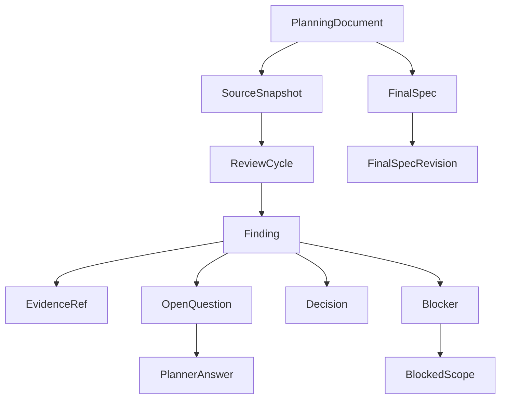

---
meta:
  title: "기획 검토 시스템의 핵심 객체는 어떻게 연결되는가"
  contentType: "Reference"
  category: "Internal planning"
status: "Draft"
---

# 기획 검토 시스템의 핵심 객체는 어떻게 연결되는가

이 문서는 기획 원문부터 최종설계와 구현 근거까지 추적하는 핵심 도메인 객체와 관계를 정의한다. [문서 계획](../00_INDEX.md#문서-계획)에 따라 Notion 입출력 방식보다 먼저 내부 식별자와 불변 규칙을 확정한다.

## 모델링 원칙

도메인 모델은 원문, 검토 결과, 결정, 차단 범위, 최종 구현 기준을 서로 다른 객체로 관리한다.

- 내부 객체는 시스템이 발급한 불변 식별자를 사용한다
- Notion 페이지 ID, 파일 경로, Git 브랜치 같은 외부 식별자는 내부 식별자를 대체하지 않는다
- 기획 원문과 확정된 이력은 덮어쓰지 않는다
- 변경된 결정은 이전 결정을 수정하지 않고 새 결정이 이전 결정을 대체한다
- 인공지능(AI) 분석 결과는 후보 정보다. 개발자가 검증한 결과만 확정 이력에 반영한다
- 상태 변경과 추적 관계는 객체 내용과 분리해 관리한다

식별자의 저장 형식은 데이터베이스 설계에서 정한다. 이 문서는 각 객체가 독립적인 `*_id`를 가져야 한다는 의미만 확정한다.

## 핵심 객체 관계

핵심 객체는 다음 관계를 가진다.

변경 추적용 `ChangeSet`, `ChangeItem`, `ImpactLink`와 구현 연결용 `ImplementationRef`는 같은 객체를 참조한다. 자세한 관계는 [추적 모델](./traceability-model.md)에서 정의한다.

## 기획 원문 객체

기획 원문 계층은 논리적 문서와 실제 수집본을 분리한다.

### `PlanningDocument`

`PlanningDocument`는 하나의 기획 주제를 나타내는 논리적 문서다.

최소 속성은 다음과 같다:

- `planning_document_id`: 내부 불변 식별자
- `title`: 개발자가 식별하는 문서명
- `source_type`: 외부 원문 시스템 종류
- `source_ref`: 외부 문서를 다시 찾기 위한 참조값

외부 문서가 수정돼도 같은 기획 주제라면 `PlanningDocument`는 유지한다.

### `SourceSnapshot`

`SourceSnapshot`은 특정 시점에 확보한 기획 원문의 불변 사본이다.

최소 속성은 다음과 같다:

- `source_snapshot_id`: 내부 불변 식별자
- `planning_document_id`: 소속 기획 문서
- `previous_snapshot_id`: 바로 이전 Snapshot
- `content_hash`: 원문 내용의 물리적 변경 판별값
- `captured_at`: 원문을 확보한 시점
- `content_ref`: 보존된 원문 내용의 위치

동일한 `content_hash`를 다시 수집하면 새 의미 변경으로 취급하지 않는다. 실제 저장 중복 제거 방식은 저장소 설계에서 정한다.

## 검토 객체

검토 계층은 한 번의 검토 과정과 그 과정에서 발견한 항목을 분리한다.

### `ReviewCycle`

`ReviewCycle`은 하나의 `SourceSnapshot`을 현재 코드와 정책에 대조한 검토 단위다.

최소 속성은 다음과 같다:

- `review_cycle_id`: 내부 불변 식별자
- `target_snapshot_id`: 이번 검토 대상
- `baseline_snapshot_id`: 변경 검토에서 비교할 이전 Snapshot, 최초 검토에서는 비어 있음
- `code_baseline_ref`: 검토에 사용한 코드 기준점
- `review_type`: `INITIAL` 또는 `CHANGE`
- `status`: [상태 모델](./state-model.md)의 `ReviewCycle` 상태

같은 Snapshot을 다시 검증해야 하면 기존 결과를 수정하지 않고 새 `ReviewCycle`을 만들 수 있다.

### `Finding`

`Finding`은 검토에서 발견한 하나의 문제 또는 결정 필요 항목이다.

최소 속성은 다음과 같다:

- `finding_id`: 내부 불변 식별자
- `review_cycle_id`: 발견된 검토 단위
- `finding_type`: 발견 원인 분류
- `decision_owner`: 최종 결정 책임
- `blocking`: 현재 진행을 막는지 여부
- `summary`: 결정해야 할 문제의 요약
- `status`: [상태 모델](./state-model.md)의 `Finding` 상태

`finding_type`, `decision_owner`, `blocking`은 서로 독립된 축이다. 예를 들어 하나의 Finding은 `REQUIREMENT_GAP`, `PLANNER`, `blocking=true`를 동시에 가질 수 있다.

`finding_type`은 다음 값만 사용한다:

- `CODE_MISMATCH`: 현재 코드 구조나 구현과 기획이 충돌함
- `POLICY_CONFLICT`: 확정된 도메인 정책과 신규 기획이 충돌함
- `DOCUMENT_CONFLICT`: 관련 기획 문서끼리 정의가 충돌함
- `LOGIC_DEFECT`: 같은 기획 원문 내부의 조건과 결과가 모순됨
- `REQUIREMENT_GAP`: 구현에 필요한 조건이나 결과가 없음
- `AMBIGUITY`: 둘 이상의 구현 의미로 해석할 수 있음

`decision_owner`는 `DEVELOPER` 또는 `PLANNER`다. Blocker 여부는 결정 주체와 무관하다.

### `EvidenceRef`

`EvidenceRef`는 Finding이나 Decision의 판단 근거를 고정된 기준점에 연결한다.

근거 유형은 다음과 같다:

- `SOURCE`: 특정 `SourceSnapshot`의 원문 위치
- `RELATED_DOCUMENT`: 관련 기획 문서의 특정 Snapshot
- `FINAL_SPEC`: 특정 `FinalSpecRevision`
- `CODE`: 저장소의 특정 commit, path, symbol, line range
- `DECISION`: 기존 `Decision`
- `IMPLEMENTATION`: `ImplementationRef`

코드 근거는 mutable branch tip을 근거로 사용하지 않는다. 최소한 repository, commit SHA, path를 고정한다.

## 결정 객체

결정 계층은 개발자 결정과 기획자 결정을 같은 이력 모델로 관리한다.

### `Decision`

`Decision`은 Finding에 대해 최종 채택한 결과다.

최소 속성은 다음과 같다:

- `decision_id`: 내부 불변 식별자
- `finding_id`: 해결 대상 Finding
- `owner`: `DEVELOPER` 또는 `PLANNER`
- `adopted_option`: 채택 결과
- `rationale`: 채택 근거
- `supersedes_decision_id`: 대체한 이전 Decision
- `status`: [상태 모델](./state-model.md)의 Decision 상태

기획자 답변 자체는 Decision이 아니다. 개발자가 답변을 재검증한 뒤 채택해야 `PLANNER` Decision이 된다.

### `OpenQuestion`

`OpenQuestion`은 `decision_owner=PLANNER`인 Finding에서 기획자 답변이 필요한 동안 존재한다.

최소 속성은 다음과 같다:

- `open_question_id`: 내부 불변 식별자
- `finding_id`: 질문의 원인 Finding
- `question`: 결정해야 하는 내용
- `options`: 실제 채택 가능한 선택지
- `tradeoffs`: 각 선택지의 영향
- `developer_recommendation`: 개발 권장안과 근거
- `status`: [상태 모델](./state-model.md)의 OpenQuestion 상태

개발자 판단만으로 해결하는 Finding에는 Open Question을 만들지 않는다.

### `PlannerAnswer`

`PlannerAnswer`는 기획자가 Open Question에 남긴 답변의 불변 기록이다.

최소 속성은 다음과 같다:

- `planner_answer_id`: 내부 불변 식별자
- `open_question_id`: 답변 대상
- `answer`: 기획자가 선택하거나 작성한 내용
- `answered_at`: 답변 시점
- `supersedes_answer_id`: 기획자가 이전 답변을 수정한 경우의 선행 답변

답변을 수정해도 이전 답변을 삭제하지 않는다.

## Blocker 객체

Blocker는 결정 주체가 아니라 진행 제한을 표현한다.

### `Blocker`

`Blocker`는 `blocking=true`인 Finding에 연결된 진행 제한이다.

최소 속성은 다음과 같다:

- `blocker_id`: 내부 불변 식별자
- `finding_id`: Blocker의 원인 Finding
- `reason`: 진행을 멈춰야 하는 이유
- `resume_condition`: 다시 진행할 조건
- `status`: [상태 모델](./state-model.md)의 Blocker 상태

하나의 Finding에는 동시에 하나의 활성 Blocker만 둔다. 과거 Blocker 이력은 삭제하지 않는다.

### `BlockedScope`

`BlockedScope`는 Blocker가 실제로 막는 범위를 구조화한다. 하나의 Blocker는 여러 Scope를 가질 수 있다.

최소 속성은 다음과 같다:

- `blocked_scope_id`: 내부 불변 식별자
- `blocker_id`: 소속 Blocker
- `scope_type`: 막힌 범위의 종류
- `target_ref`: 실제로 멈출 설계 또는 작업의 안정적인 참조값
- `description`: 기획자와 개발자가 이해할 수 있는 범위 설명
- `resume_work`: Blocker 해결 후 다시 시작할 작업

`scope_type`은 다음 네 수준을 사용한다:

- `FEATURE`: 기능 전체
- `DESIGN`: 특정 정책, 데이터 구조, 계산 규칙
- `IMPLEMENTATION`: 특정 API, 저장 로직, 계산 로직
- `WORK_ITEM`: 테스트, 마이그레이션, 연동 같은 작업 단위

자유 텍스트 설명만으로 차단 범위를 식별하지 않는다. `target_ref`를 통해 후속 작업과 연결한다.

## 최종설계 객체

최종설계는 논리적 문서와 불변 Revision을 분리한다.

### `FinalSpec`

`FinalSpec`은 하나의 `PlanningDocument`에서 파생된 실제 구현 기준 문서다.

최소 속성은 다음과 같다:

- `final_spec_id`: 내부 불변 식별자
- `planning_document_id`: 기준 기획 문서
- `current_revision_id`: 현재 구현 기준 Revision

### `FinalSpecRevision`

`FinalSpecRevision`은 특정 시점에 확정한 최종설계의 불변 버전이다.

최소 속성은 다음과 같다:

- `final_spec_revision_id`: 내부 불변 식별자
- `final_spec_id`: 소속 최종설계
- `previous_revision_id`: 이전 Revision
- `based_on_snapshot_ids`: 반영한 기획 원문 Snapshot
- `decision_ids`: 반영한 확정 Decision
- `content_ref`: 확정 문서 위치
- `created_at`: 확정 시점

새 기획 변경을 반영하면 새 Revision을 만든다. 이전 Revision은 당시 구현 기준으로 계속 조회할 수 있어야 한다.

## 도메인 불변 규칙

구현은 다음 규칙을 항상 지켜야 한다:

1. `SourceSnapshot`, `PlannerAnswer`, 확정 `Decision`, `FinalSpecRevision`은 이력을 덮어쓰지 않는다
2. Finding의 발견 유형, 결정 주체, blocking 여부를 하나의 enum으로 합치지 않는다
3. 기획자 답변은 개발자 재검증 전까지 확정 Decision이 아니다
4. Blocker는 반드시 하나 이상의 `BlockedScope`와 재개 조건을 가진다
5. 확정 Decision은 하나 이상의 근거를 추적할 수 있어야 한다
6. 코드 근거는 commit SHA를 포함한 불변 기준점에 연결한다
7. 변경된 결정은 `supersedes_decision_id`로 이전 결정을 보존한다
8. 현재 `FinalSpecRevision`은 반영한 Snapshot과 Decision을 역추적할 수 있어야 한다
