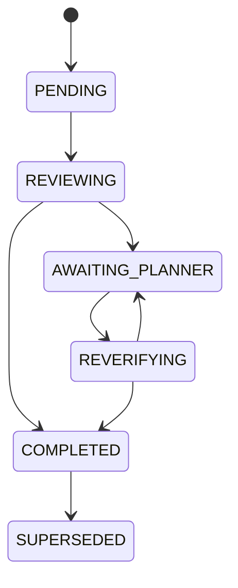
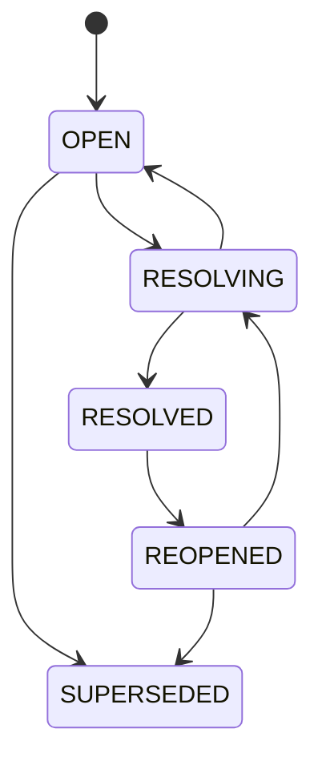
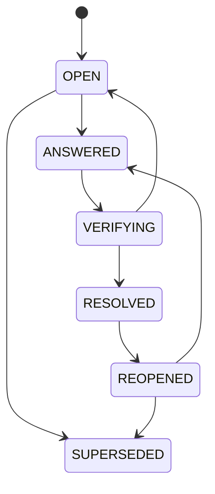

---
meta:
  title: "검토와 결정의 상태는 어떻게 바뀌는가"
  contentType: "Reference"
  category: "Internal planning"
status: "Draft"
---

# 검토와 결정의 상태는 어떻게 바뀌는가

이 문서는 [도메인 모델](./domain-model.md)의 상태와 전이 규칙을 정의한다.
[문서 계획](../00_INDEX.md#문서-계획)에 따라 내부 상태를 고정하며, Notion에 표시할 업무 상태와 답변 수집 방식은 [Notion 검토 결과 계약](../integration/notion-review-contract.md)을 따른다.

## 상태 모델 원칙

상태는 객체별 책임에 맞게 분리한다.

- `ReviewCycle` 상태가 전체 검토 진행도를 표현한다
- `Finding` 상태가 개별 문제의 해결 여부를 표현한다
- `OpenQuestion` 상태가 기획자 답변과 재검증 진행도를 표현한다
- `Decision` 상태가 현재 채택 결과의 유효성을 표현한다
- `Blocker` 상태가 차단 범위의 활성 여부를 표현한다
- 부모 상태는 자식 상태를 임의로 덮어쓰지 않는다
- 과거 확정 상태는 변경 시 삭제하지 않고 재개 또는 대체 이력으로 남긴다

## `ReviewCycle` 상태

`ReviewCycle`은 다음 상태를 사용한다:

- `PENDING`: 검토 대상 `PlanningDocumentSnapshot`을 확보했지만 검토를 시작하지 않음
- `REVIEWING`: 코드, 정책, 관련 문서와 대조하는 중
- `AWAITING_PLANNER`: 미해결 `PLANNER` Finding이 있어 기획자 답변을 기다림
- `REVERIFYING`: 기획자 답변이나 변경 영향을 다시 검증하는 중
- `COMPLETED`: 구현에 필요한 Finding이 모두 해결됨
- `SUPERSEDED`: 더 최신 ReviewCycle이 같은 목적의 검토 기준을 대체함

기본 전이는 다음과 같다:

`REVIEWING`에서 개발자 결정만 남아 있으면 `AWAITING_PLANNER`를 거치지 않는다.
새 `PlanningDocumentSnapshot`이 발생하면 기존 완료 ReviewCycle은 보존하고 새 `CHANGE` ReviewCycle을 만든다.

## `Finding` 상태

`Finding`은 다음 상태를 사용한다:

- `OPEN`: 문제를 발견했으며 결정이 확정되지 않음
- `RESOLVING`: 개발 결정 또는 기획자 답변을 검토하는 중
- `RESOLVED`: 유효한 Decision으로 해결됨
- `REOPENED`: 변경 영향으로 기존 해결 결과를 다시 검토해야 함
- `SUPERSEDED`: 다른 Finding이 같은 문제를 대체함

기본 전이는 다음과 같다:

`RESOLVED`는 활성 Decision이 존재하고 필요한 Blocker가 해제된 경우에만 설정한다.

## `OpenQuestion` 상태

`OpenQuestion`은 기획자 답변과 개발자 재검증을 분리한다.

- `OPEN`: 기획자 답변이 필요함
- `ANSWERED`: 기획자 답변을 수집했지만 아직 검증하지 않음
- `VERIFYING`: 개발자가 답변을 코드와 정책에 다시 대조하는 중
- `RESOLVED`: 답변을 검증하고 `PLANNER` Decision을 확정함
- `REOPENED`: 변경이나 새 충돌 때문에 다시 답변이 필요함
- `SUPERSEDED`: 다른 질문이 기존 질문을 대체함

기본 전이는 다음과 같다:

답변을 받았다는 이유만으로 `RESOLVED`로 전이하지 않는다. 재검증에서 충돌을 발견하면 기존 답변 이력을 보존하고 질문을 다시 연다.

## `Decision` 상태

Decision은 다음 상태를 사용한다:

- `ADOPTED`: 현재 유효한 채택 결과
- `SUPERSEDED`: 새 Decision이 이 결정을 대체함
- `INVALIDATED`: 근거가 깨져 더 이상 구현 기준으로 사용할 수 없음

Decision은 초안 상태를 저장하지 않는다. 검토 중 선택지는 Finding 또는 Open Question에 남기고, 채택이 끝난 결과만 Decision으로 만든다.

`ADOPTED` Decision을 변경해야 하면 새 Decision을 생성하고 `supersedes_decision_id`로 기존 Decision을 연결한다. 단순 변경 영향 분석만으로 대체안이 확정되지 않았으면 기존 Decision을 `INVALIDATED`로 전환하고 Finding을 `REOPENED`로 만든다.

## `Blocker` 상태

Blocker는 다음 상태를 사용한다:

- `ACTIVE`: 하나 이상의 `BlockedScope`가 진행을 막음
- `RESOLVED`: 재개 조건을 충족해 모든 Scope를 다시 진행할 수 있음
- `SUPERSEDED`: 새 Blocker가 같은 제한을 대체함

Blocker가 `ACTIVE`여도 `BlockedScope` 밖의 작업은 계속할 수 있다. `RESOLVED`로 전이할 때 `resume_work`에 연결된 작업을 재개 대상으로 표시한다.

## 부모 상태 계산 규칙

`ReviewCycle` 상태는 하위 객체를 기준으로 다음 규칙을 적용한다:

1. 검토 시작 전이면 `PENDING`
2. 검토가 진행 중이고 아직 분류가 끝나지 않았으면 `REVIEWING`
3. 미해결 `PLANNER` Finding 중 답변이 필요한 항목이 하나라도 있으면 `AWAITING_PLANNER`
4. 기획자 답변을 하나라도 재검증 중이면 `REVERIFYING`
5. 모든 구현 필수 Finding이 `RESOLVED` 또는 `SUPERSEDED`이고 활성 Blocker가 없으면 `COMPLETED`

기획자 확인이 필요하지 않은 참고성 Finding을 별도로 도입할 경우 완료 계산 규칙을 그 시점에 확장한다.

## 재개와 변경 규칙

개발 중 신규 `PlanningDocumentSnapshot`이 생기면 기존 상태를 일괄 초기화하지 않는다.

- 물리적 내용이 같으면 새 변경 검토를 만들지 않는다
- 의미 변화가 없으면 기존 Decision과 Finding을 유지한다
- 영향받은 `RESOLVED` Finding만 `REOPENED`하거나 새 Finding으로 연결한다
- 무효화된 Decision은 `INVALIDATED` 또는 `SUPERSEDED`로 이력을 남긴다
- 변경과 무관한 Blocker와 Decision은 기존 상태를 유지한다
- 갱신된 최종설계는 새 `FinalSpecRevision`으로 만든다

이 규칙은 [추적 모델](./traceability-model.md)의 `ImpactLink` 판정과 함께 사용한다.
